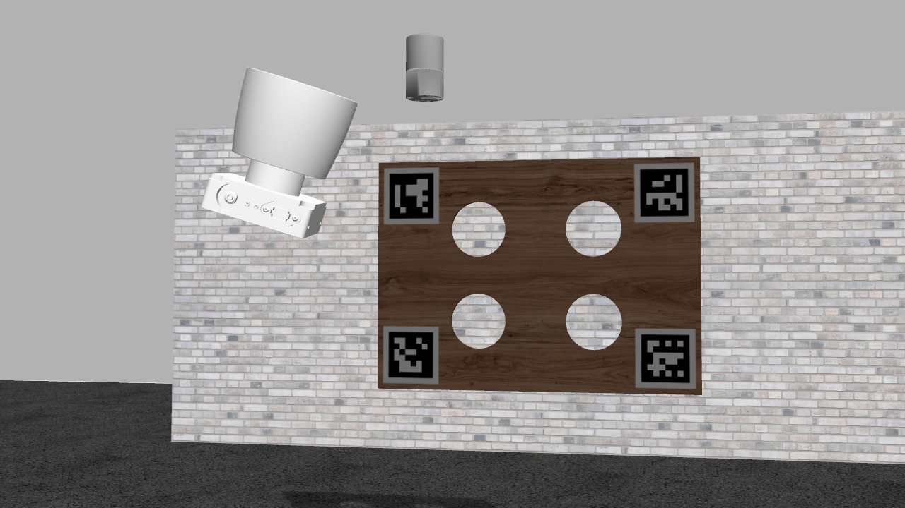

# velo2cam_gazebo [](http://build.ros.org/job/Kdev__velo2cam_gazebo__ubuntu_xenial_amd64/4/)
Repository including Gazebo models, plugins and worlds to test algorithms for extrinsic calibration of lidar-camera pairs. Package developed at Intelligent Systems Laboratory (http://www.uc3m.es/islab), Universidad Carlos III de Madrid.

# Supported sensors

* Bumblebee XB3 Camera
* Velodyne VLP-16
* Velodyne HDL-32
* Velodyne HDL-64



# Gazebo models (need to be moved to ~/.gazebo/models/) so that they can be inserted in Gazebo worlds
This repository includes several sensors and calibration target models to evaluate the performance of extrinsic calibration of lidar-camera pair in the Gazebo Simulator.

Note: The models included in this repository were designed for evaluating the LIDAR-camera calibration algorithm described in [1], whose code is provided in *https://github.com/beltransen/velo2cam_calibration*

Sensors:

* Bumblebee XB3 Camera (Left - center only)
* Velodyne VLP-16 (Based on https://bitbucket.org/DataspeedInc/velodyne_simulator)
* Velodyne HDL-32 (Based on https://bitbucket.org/DataspeedInc/velodyne_simulator)
* Velodyne HDL-64 (Since 3D meshes are not available, those of HDL-32 model are used instead)

Calibration targets:

* Calibration pattern with wood (maple) texture
* Calibration pattern with chessboard texture
* Chessboard planes for recreating worlds required to test the KIT Calibration Toolbox (http://www.cvlibs.net/software/calibration/)

# Gazebo plugins (compilation of the pkg installs the lib in the proper directory)
* Velodyne plugin providing PointCloud2 with same structure as driver (x, y, z, intensity, ring) and simulated Gaussian noise. (Code from https://bitbucket.org/DataspeedInc/velodyne_simulator, although minor patch for vertical resolution issue is included)

# Known Issues
* Gazebo can take up to 30 seconds to load the VLP-16 pluggin, 60 seconds for the HDL-32E, and much more HDL-64E
* Gazebo cannot maintain 10Hz with large pointclouds
    * Solution: User can reduce number of points in urdf

# Example Gazebo Calibration Scenario
```roslaunch velo2cam_gazebo real_stereoVLP16_trans.launch```

# Citation #
[1] *"Automatic Extrinsic Calibration for Lidar-Stereo Vehicle Sensor Setups"* submitted to *International Conference on Intelligent Transportation Systems (ITSC) 2017*.

For citation details, please contact Jorge Beltran (jbeltran AT ing.uc3m DOT es) or Carlos Guindel (cguindel AT ing.uc3m DOT es).

